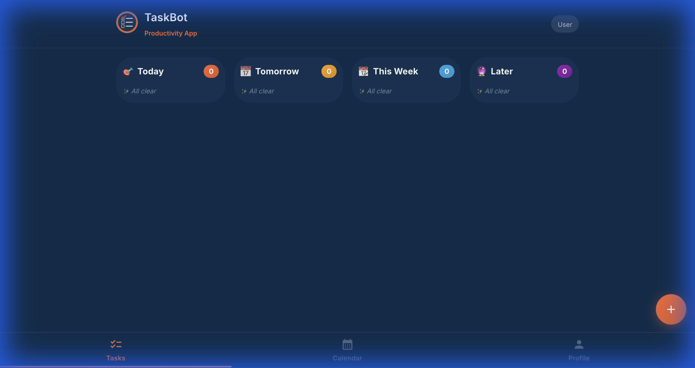

# Serverless Telegram To-Do Bot (v1.0)

A production-grade, serverless task management bot for Telegram, powered by AWS Lambda and React.

<p align="center">
  
  
</p>

## Overview
This project delivers a full-featured Mini App experience within Telegram. It combines a secure AWS Serverless backend with a polished React frontend, featuring gamification (XP, streaks), natural language processing for tasks, and motivational engagement tools.

## Architecture

- **AWS Lambda** - Serverless compute (webhook handler, reminder handler, motivation handler)
- **Amazon DynamoDB** - NoSQL database for tasks, user settings, and motivational messages
- **Amazon API Gateway** - HTTP endpoint for Telegram webhooks
- **Amazon EventBridge Scheduler** - One-time scheduled events for reminders
- **AWS Secrets Manager** - Secure bot token storage
- **AWS SAM** - Infrastructure as Code

## Project Structure

```
telegram-bot-platform/
├── template.yaml              # AWS SAM template
├── lambda/
│   ├── webhook_handler/       # Main Telegram webhook handler
│   │   ├── app.py
│   │   ├── requirements.txt
│   │   └── handlers/
│   ├── reminder_handler/      # EventBridge-triggered reminder sender
│   │   ├── app.py
│   │   └── requirements.txt
│   └── motivation_handler/    # Daily motivation message sender
│       ├── app.py
│       └── requirements.txt
├── scripts/
│   ├── deploy.sh              # Automated deployment script
│   └── set-webhook.sh         # Set Telegram webhook URL
└── README.md
```

## Prerequisites

- AWS CLI configured with credentials
- AWS SAM CLI installed
- Python 3.9
- Telegram bot token from @BotFather
- Node.js & NPM (for Mini App)

## Key Features
- **📊 Interactive Mini App**: React-based UI with glassmorphism design, animations, and haptic feedback.
- **🎮 Gamification System**: Earn XP, level up, unlock achievements, and maintain daily streaks.
- **🧠 Natural Language AI**: Uses Gemini to intelligently parse "Buy milk tomorrow at 5pm" into structured data.
- **🔔 Smart Notifications**: Recurring reminders (via EventBridge) and gamified in-app toasts.
- **💪 Motivation Board**: Daily inspirational quotes on startup to boost engagement.
- **🛡️ Enterprise Security**: Role-based access, signed webhook validation, and least-privilege IAM policies.

## Quick Start

### 1. Store Bot Token

```bash
aws secretsmanager create-secret \
  --name telegram-bot-token \
  --secret-string "YOUR_BOT_TOKEN_HERE" \
  --region us-east-1
```

### 2. Build and Deploy

```bash
# Build Lambda functions
sam build

# Deploy to AWS
sam deploy --guided
```

### 3. Set Telegram Webhook

```bash
# Get webhook URL from SAM outputs
WEBHOOK_URL=$(aws cloudformation describe-stacks \
  --stack-name telegram-bot-platform \
  --query 'Stacks[0].Outputs[?OutputKey==`WebhookUrl`].OutputValue' \
  --output text)

# Set webhook
./scripts/set-webhook.sh $WEBHOOK_URL
```

## Local Development

Local testing is not applicable for this serverless architecture. Use AWS SAM local invoke for testing:

```bash
# Test webhook handler
sam local invoke WebhookHandlerFunction -e events/test-message.json

# Start local API
sam local start-api
```

## Environment Variables

All environment variables are managed through AWS SAM template:
- `TASKS_TABLE_NAME` - DynamoDB table for tasks
- `USERS_TABLE_NAME` - DynamoDB table for user settings
- `MOTIVATION_TABLE_NAME` - DynamoDB table for motivational messages
- `BOT_TOKEN_SECRET` - Secrets Manager secret name
- `REMINDER_LAMBDA_ARN` - ARN of reminder handler Lambda

## Cost Estimation

- Lambda: ~$1-2/month (within free tier)
- DynamoDB: ~$1/month
- API Gateway: <$1/month (within free tier)
- EventBridge: Minimal ($1 per million schedules)
- **Total: ~$2-5/month**

## Continuous Integration & Deployment (CI/CD)

This project uses a production-grade **GitHub Actions** pipeline for reliability and security.

- **CI (`ci.yml`)**: Runs Linting (Ruff), Unit Tests (Pytest), and SAM Validation on every Pull Request.
- **CD (`cd.yml`)**: Automatically deploys to AWS via OIDC authentication when changes are merged to `main`.

For detailed setup instructions and architecture, see [README_CICD.md](README_CICD.md).

## Deployment

For manual deployment (dev/test), see [DEPLOYMENT.md](DEPLOYMENT.md). For production, rely on the automated pipeline.

## License

MIT
